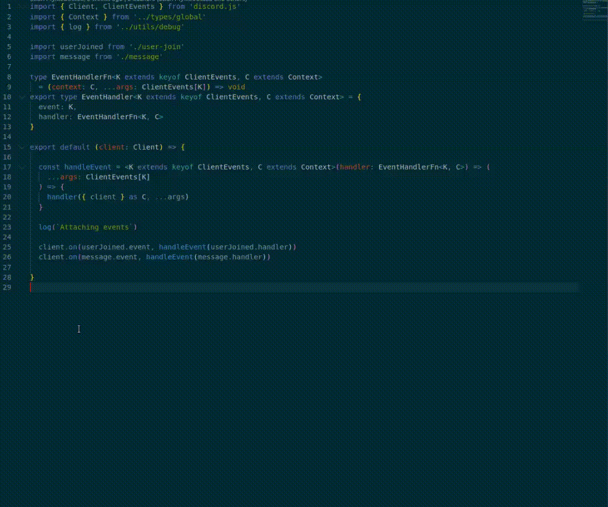

# Reference

Reference adds just one command, **Copy Reference**, which you can access through the command pallet or the right click context menu in editor.

## Features

Place your caret on the desired line or select a block of code. Then using the right click context menu or command pallet
select the **Copy Reference** command. The reference will be copied to your clipboard! It's that simple!



---

There are two formats you can get. The simple format is generated when you have no selection, and looks like

```
`<project name>/path/to/file:<line in file as caret position>`
```

The more extensive variant id generated when you have a selection, and will include the selected code as a
codeblock.

## Known Issues

 - None so far.

## Release Notes

### 1.0.0

Initial release of **Reference**